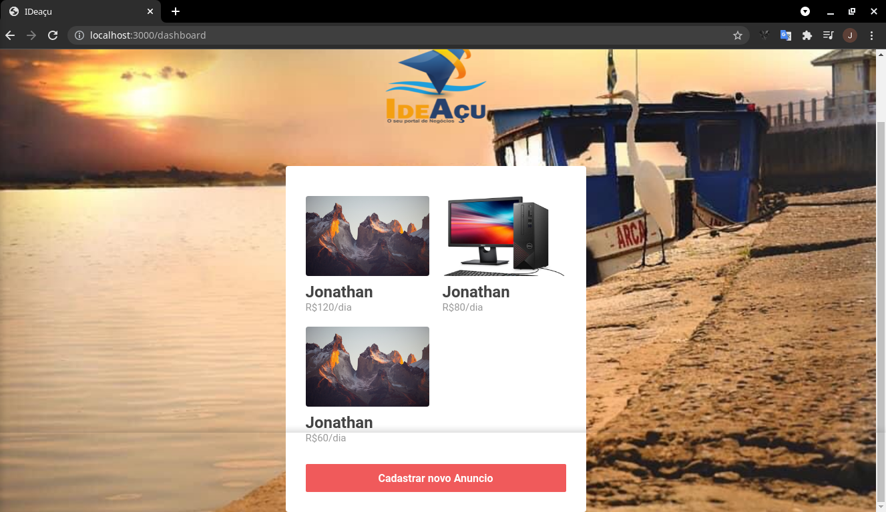
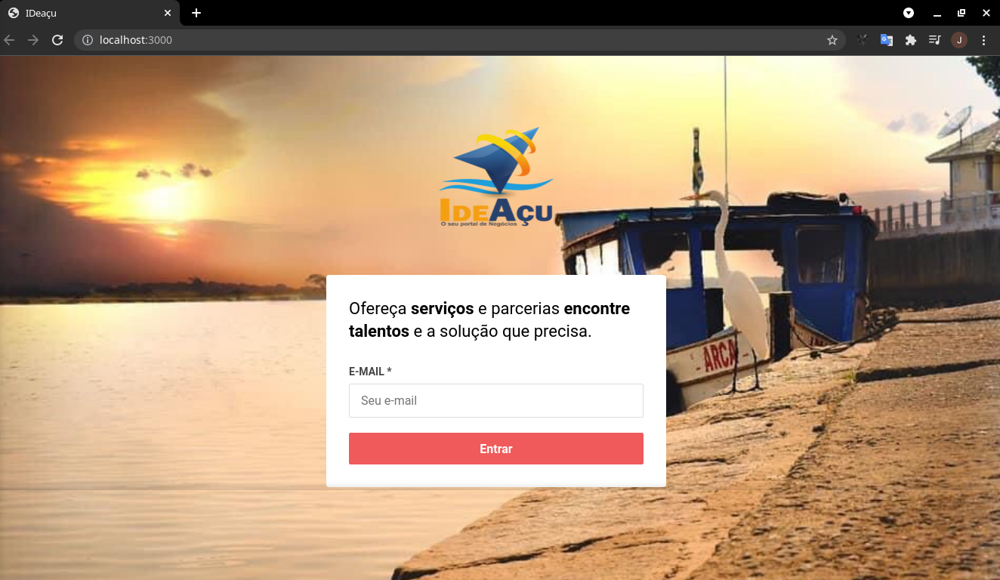

<h1 align="center">
    
</h1>

<h4 align="center">
  ☕ Code and coffee
</h4>

  
  

  

 <h4>Para rodar</h4>
 **rode {yarn} dentro dos respectivos diretórios
 {yarn dev} para iniciar o sistema backend
 e
 {yarn start} para iniciar o frontend

Um site e aplicativo intuitivos, que funcionarão como uma vitrine de negócios, onde a comunidade local poderá se cadastrar tanto como consumidor de produtos, serviços e até fornecedora dos mesmos. 
Antes de se cadastrar terão a disposição tutorial por escrito e por vídeo ensinando como se cadastrar e usufruir  de todas ferramentas  propostas e disponibilizadas, garantindo a acessibilidade a todos.
Com o cadastro dos usuários se formará uma rede de negócios locais que trará maior visibilidade e poder de fornecimento, inclusive podendo ser usado para parcerias entre pequenos fornecedores.  Resolvendo o problema de quem deseja consumir produtos e serviços locais e desconhece os fornecedores e aumentando a lucratividade dos fornecedores que ainda não estão inseridos no mundo virtual, gerando renda, aumentando a empregabilidade e consequentemente proporcionando o desenvolvimento econômico da região.
As pessoas e empresas a procura de serviços ou produtos locais se cadastrariam pra ter acesso a fornecedores de produtos e serviços, sendo que os  fornecedores ainda poderiam fazer parcerias para fortacelerem seu poder de oferta e negociação com empresas consumidoras.
A rentabilidade do projeto seria as custas do fornecedor através super likes, ou seja, o fornecedor que quer ter seu produto ou serviço anunciado de forma destacada (como um anúncio patrocinado) teria que comprar um pacote de super likes e acontecendo a negociação atravésdo site ou aplicativo pagaria uma pequena porcentagem sobre o valor da operação.

